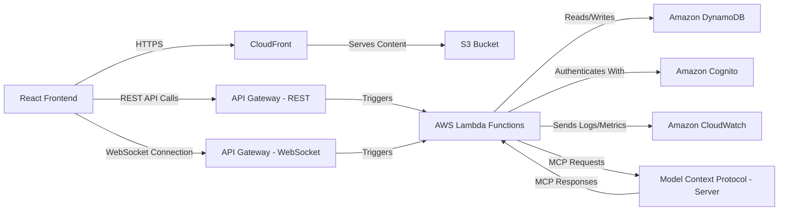

# High-Level Architecture Diagram

This diagram provides a high-level overview of the serverless real-time communication application's architecture on AWS, illustrating the main components and their interactions, including the integration points for AWS Lambda and the Model Context Protocol (MCP).

